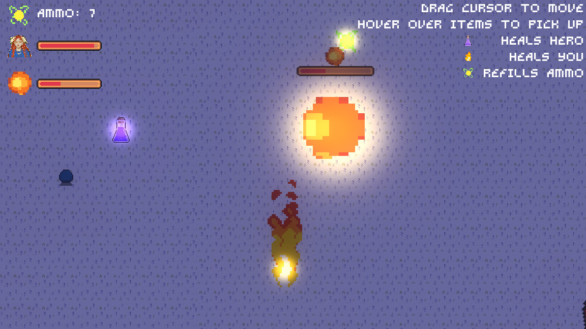

# BUETGameJam2024-DOGAMRISEN-Godot-TopDown2DReverseVampireSurvivor-MAYA

## name: MAYA

### link: https://tanzeem-ahmed-sakib.itch.io/maya

This game is a submission for BUET CSE FEST 2024 GAME JAM, created around the theme "Heroes Never Die".

### About the Game:

Step into a cold, unforgiving world in this top-down 2D pixel adventure, where the roles are reversed. Inspired by the hit game Vampire Survivors, you are not the hero—but the one who ensures the hero survives. Instead of taking center stage, you play a critical supporting role, tasked with keeping a brave Nordic woman, Maya, the hero, supplied with essential resources as she battles through relentless challenges.

But **beware:** the harsh cold is just as much your enemy as the monsters in your path. The freezing environment threatens to drain your strength, so managing resources for both yourself and the hero is key to survival. Can you keep the hero alive long enough to ensure that "Heroes Never Die"?

### Features:

**Top-down 2D Pixel Art:** Immerse yourself in a beautifully crafted, pixel-based world with Nordic influences.

**Resource Management:** Gather and provide essential supplies to the hero while battling against the harsh cold.

**Unique Role:** Experience a fresh twist on the hero dynamic—support the hero rather than being the protagonist.

**Survive the Cold:** The environment isn't just a backdrop; the freezing temperatures pose a constant threat to you.

### Gameplay Overview Trailer:

### Assets used:

https://rowdy41.itch.io/freya-character-sprites

https://nyknck.itch.io/fireball-animation

https://sanctumpixel.itch.io/fire-column-pixel-art-effect

https://jotson.itch.io/gravity-pixel-font

https://wurls.itch.io/snowy-asset-pack

https://toffeecraft.itch.io/slime-pixel-animations

https://www.freepik.com/icon/location_408167

https://kingkelp.itch.io/8guns

https://whatneyesore.itch.io/antidote-animated-sprites

https://adwitr.itch.io/pixel-health-bar-asset-pack-2

https://makertech.itch.io/additional-art-for-godot-4-tutorial

https://pixabay.com/sound-effects/howling-wind-14499/

https://pixabay.com/music/world-nord-wind-16105/

-Led the design, development, and implementation of core gameplay mechanics, player
controls, and resource management systems.

-Created pixel art assets, animations, and sound effects to enhance the game's aesthetic
and user experience.

-Adapted game mechanics and level designs to fit the jam’s themes, ensuring a cohesive
and engaging player experience.

-Managed the full lifecycle of game development, from concept to prototype, within time
constraints.

-Successfully developed and released multiple playable games, with each submission
highlighting unique gameplay elements and creative interpretations of the jam themes.

-Demonstrated strong time management skills, delivering polished games on tight
deadlines.
